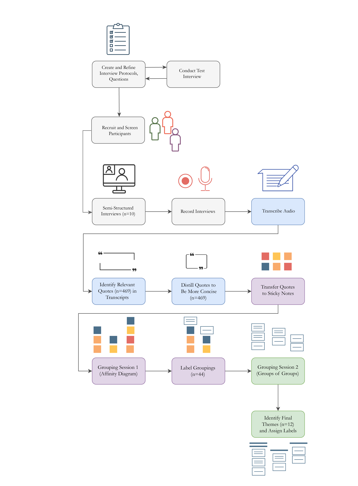
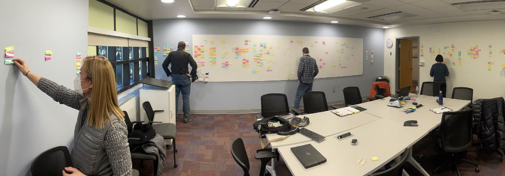

My roles:
Lead researcher  
Lead study, protocol, and question design  
Lead participant recruitment and organization  
Data analysis and synthesis

Problem:  
Diversifying agriculture in areas like the US Corn Belt, where the majority of land is dedicated to a few annual crops,
presents real opportunity for both economic benefit for farmers but also environmental benefit for people and the land.
In tandem, digital agriculture has opportunity to identify areas suitable for diversification as well as suggest
alternative management practices. Unfortunately, adoption of these tools remains low. This study aimed to explore how
farmers who have already diversified their farming operations have done so, and how they have gone about making those decisions.

Research Methods:  
This study was funded by the Iowa Nutrient Research Center in March 2020, and was originally proposed as a field study. However,
like many human research studies, plans quickly changed and field studies were replaced with interviews. Participants were
initially recruited a well-known farmer-to-farmer learning organization, and afterwards snowball sampled. After screening,
11 participants from 10 farming operations completed the 90 minutes interviews. Interviews focused on the tasks, tools, and people
involved in diversifying their operations.

Interviews were then transribed and prominent quotes (n=469) were transferred to sticky notes. As a group the research team (2x agronomists, engineer, sociologist, myself) used affinity diagramming to group the sticky notes into similar categories (n=44). A second grouping was then done, putting similar groups together to identify 12 overarching themes.

